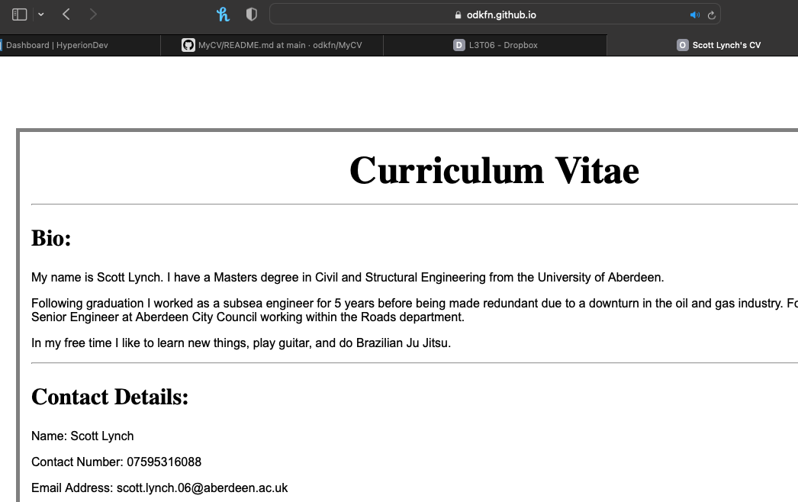

Project Title: MyCV

Description: This task (L3T5 Compulsory Task 2) is a HTML exercise which presents my CV as a webpage.

Table of Contents: N/A as the scope of this task (and the accompanying README) is small.

Installation: The contents of this file is a single document called 'index.HTML' - this can be downloaded and amended, or simply viewed online via git pages.

Credits: Scott Lynch.  No other task contributors.
